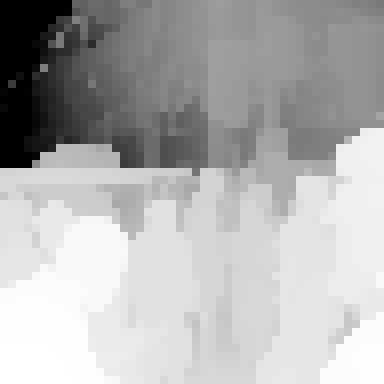
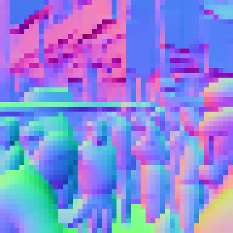
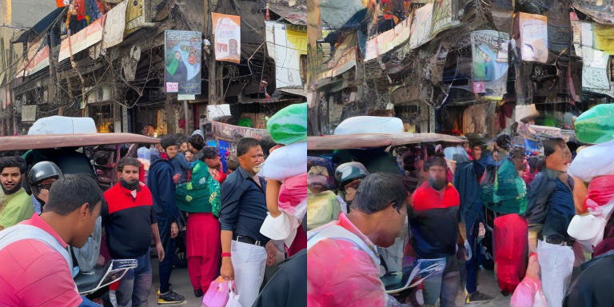
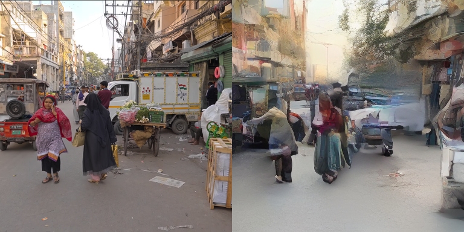
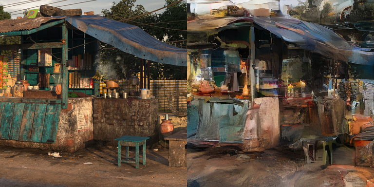
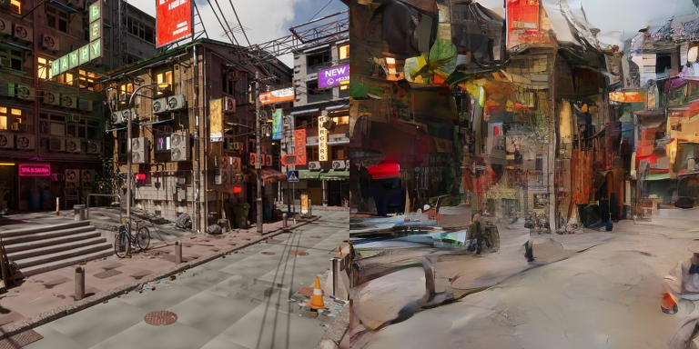

# Neural Street Render

Turning a 3D scene into photoreal street video by **steering a diffusion model with
geometry (depth + normals) while using the rendered texture as a noised canvas.**

A from-scratch proof that a single mechanism — *clean depth/normals steer + noised
textured canvas* — lets a small model regenerate photoreal-ish streets from geometry,
with a built-in realism⇄consistency dial. Trained on one Delhi walking-tour video as a
v1, validated on unseen photos and on CGI/game renders.

> **Status:** mechanism proven end-to-end on real data. Quality is capped by training
> from scratch on a single video (see *Honest findings*). Code, weights, and data are
> all open (links below).

---

## The idea

A normal 3D engine paints texture you author. This paints texture a **model** has
learned, conditioned on the engine's geometry:

```
per frame:
  textured render  ──▶  add noise  ──▶  NOISED CANVAS ─┐
  depth  (z-buffer) ──▶ clean, re-injected every step ─┤
  normals(G-buffer) ──▶ clean, re-injected every step ─┼─▶ few-step denoise ─▶ decode ─▶ frame
  previous frame   ──▶ temporal context ───────────────┘
```

- **Depth + normals (clean, every step)** lock structure — the model can't hallucinate
  geometry that isn't there. Placement comes from the input, not from the model
  "detecting" anything.
- **Textured render as the noised canvas** (instead of pure noise) gives an appearance
  starting point and carries implicit "what goes where." Borrowed from Runway-style
  video-to-video.
- **Noise strength = a dial.** Low → output hugs the render (consistent, faithful).
  High → model leans on its learned prior (more realistic-looking, less faithful).
  Trained with *random* strength so the dial exists at inference.

No segmentation buffer, no identity network — normals + texture carry placement, and a
separate identity module would fight few-step distillation.

---

## Results

Comparisons are `[ real / input  |  generated ]`.

### Conditioning signals (what the model is steered by)

| depth (near = bright) | normals (view-space) |
|:---:|:---:|
|  |  |

### Generated output

**Training frame, strength 0.3** — output hugs the render; structure locked, textures plausible:



**Unseen photo, strength 1.0** — the canvas is *pure noise*, so the coherent street that
comes out is regenerated from depth + normals **alone**. This is the key result: with the
input texture fully destroyed, structure survives — proof the geometry conditioning is
genuinely load-bearing, not pass-through.



**CGI / game render → real** — takes rendered (non-photographic) input and pushes it
toward real street texture. The engine path works:





---

## Pipeline

```
extract_street.py   video → 12fps/384px windows → DA3 metric depth + DSINE normals + SD-1.5 latents
train_street.py     temporal U-Net: noised-texture canvas + clean depth/normals + past frame → clean frame
sample_street.py    generate [real|generated] grids from a checkpoint, any strength
test_image.py       run the model on ANY image (OOD / CGI test) using training conventions
```

**Conventions** (recorded in `conventions.json`, must be matched by a 3D engine at
inference): 384px, 12fps, 16-frame windows; depth = DepthAnything-3 metric, per-window
2–98th percentile stretch, near = bright; normals = DSINE, view-space, `rgb = n*0.5+0.5`;
VAE = SD-1.5 (`×0.18215`).

---

## Reproduce

```bash
pip install torch torchvision diffusers transformers geffnet huggingface_hub
# DA3 (depth) clones from its repo; DSINE pulls via torch.hub automatically

# extract conditions from your own footage
python extract_street.py --setup --video your_walk.webm

# train
python train_street.py

# look at it
python sample_street.py --ckpt checkpoints_street/street_step_040000.pt --win 50 --strength 0.6 --ema

# test on any image / CGI render
python test_image.py --img some_street.jpg --strength 0.5
```

---

## Honest findings

- **The mechanism works.** Depth/normals steer + noised texture canvas regenerates
  coherent streets, generalizes to unseen frames, and accepts CGI input. The
  strength-1.0 test confirms geometry — not the input texture — drives structure.
- **Quality is capped by training from scratch on one video.** Output is
  plausible-but-painterly; fine detail (faces, signage) softens, and the single
  video's aesthetic bleeds into everything. This is a *data/approach* limit, not an
  architecture flaw.
- **You cannot collect your way to photoreal.** Frontier video models train on
  ~10⁹ clips; 100 hours of footage is ~0.01% of that. Photoreal needs a **pretrained
  prior** (e.g. fine-tuning Wan-class models with this same conditioning), not more
  from-scratch data.
- **Realtime is a solved recipe for small models** (few-step distillation + compile +
  tiny VAE decoder + self-forcing), demonstrated earlier on a face prototype at ~30 fps
  on a single RTX 3090. Porting it to a larger pretrained prior is a different
  (heavier) toolchain.

---

## Links

- **Weights, data, frames, conventions:** 🤗 [bobthebuilderinternational/delhi-street-conditions](https://huggingface.co/datasets/bobthebuilderinternational/delhi-street-conditions)
- Author portfolio: [jainaditya.in](https://jainaditya.in)

## References

Runway Gen-3 video-to-video · Wan 2.1/2.2 (arXiv 2503.20314) · Self-Forcing
(arXiv 2506.08009) · CausVid · WorldPlay (arXiv 2512.14614) · Depth Anything 3 · DSINE
